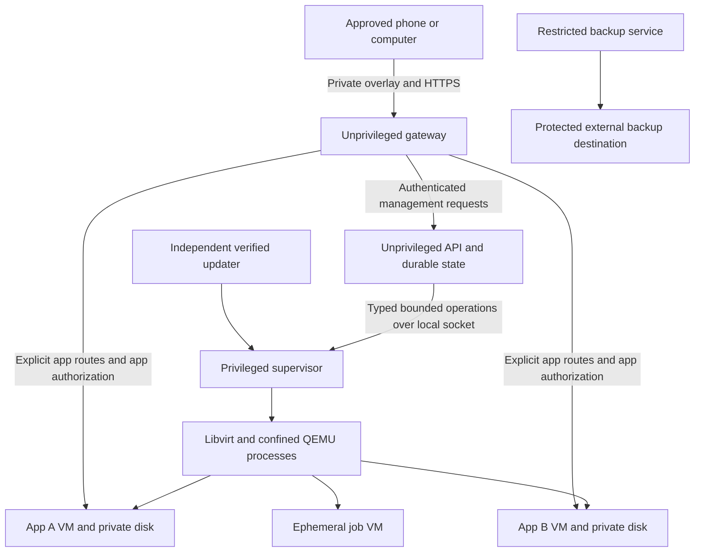

# Personal compute server security research and revised plan

Research date: 28 September 2026. Status: proposed architecture, not an implemented or audited security claim. This plan supersedes the earlier Docker-first home-server proposal. The original GPU marketplace documents remain background; marketplace billing and public workload rental are outside this product.

Product refinement: [the end-to-end specification](END_TO_END_PRODUCT_SPEC.md) now defines installation through removal, three built-in workflows, a first-party UI, and encrypted external-drive recovery. [The implementation plan](IMPLEMENTATION_PLAN.md) is the current delivery sequence and estimate. The analysis below remains the security rationale; its earlier baseline estimate is retained for context and superseded by that implementation plan.

**Recommendation.** Build a private, single-owner server appliance on a supported Linux laptop, with hardware virtualization, one VM per app, explicitly restricted networking, a small privileged supervisor, verified updates, and tested recovery. Begin with CPU workloads and a curated application catalog. Treat GPU support, arbitrary containers, public hosting, and multiple servers as separate expansions requiring additional evidence.

“Any laptop” should mean a compatibility assessment for any candidate, followed by support only where the security requirements can be enforced. It cannot mean identical isolation on every operating system, processor, or unsupported firmware. The installer must reject an unsupported configuration rather than silently weakening protection.

**Research method and confidence.** This review uses upstream runtime documentation, Linux kernel documentation, Tailscale documentation, OWASP guidance, NIST guidance, and a peer-reviewed USENIX study. Documented mechanisms are distinguished from the product choices proposed below. Upstream main/master documentation can describe features newer than distribution packages; implementation must pin supported releases and recheck capabilities and advisories. No hardware benchmark, exploit test, code audit, or penetration test has been performed. The host model is unspecified, so performance and compatibility conclusions remain conditional.

**What the research changes.** Rootless containers reduce privilege but retain a shared host kernel. Virtualization introduces a separate guest kernel, while adding a hypervisor and device interfaces that must also be confined. Neither substitutes for authorization, network policy, or resource enforcement. These properties are documented by [Docker](https://docs.docker.com/engine/security/rootless/), [QEMU](https://www.qemu.org/docs/master/system/security.html), and [gVisor](https://gvisor.dev/docs/architecture_guide/security/).

| Earlier proposal | Revised decision | Reason |
|---|---|---|
| Docker containers directly on the host | Separate VM per application trust boundary | A compromised app should first encounter a guest boundary |
| API and executor in one executable | Separate unprivileged API and narrowly privileged supervisor | Reduce authority of remotely reachable code |
| Local network first, VPN later | Private overlay for the first supported client-access path | Avoid designing local certificate distribution and router exposure simultaneously |
| Broad app installation | Small catalog with versioned permission manifests | Make privileges inspectable and testable |
| Local AI as an early feature | CPU inference after capacity checks; GPU gated separately | Device access changes the isolation model |
| Assistant applies configuration | Assistant proposes typed changes; deterministic services authorize them | Treat model output as untrusted input |
| Reboot recovery near the end | Recovery, backups, and update verification before private beta | Security depends on maintainability and recovery |
| Six to eight week MVP estimate | Gate-based program with a longer planning allowance | Security evidence and hardware compatibility are substantial work |

**Define the security claim before implementing it.** The proposed claim is: an unauthorized network peer cannot administer the server; a compromised application is constrained to its approved storage, network destinations, and resource budget; the operator can revoke access, update safely, and restore independently backed-up data. Each part requires a test and documented assumptions.

The trusted computing base includes firmware, CPU and microcode, the host OS and kernel, virtualization stack, enforced host policies, supervisor, authentication services, update trust roots, and relevant cryptographic libraries. Trusting fewer processes does not remove this base. Host root or a compromised hypervisor can access guest data. This design does not provide confidential computing against the laptop owner, universal protection from hardware side channels, or cloud availability from one laptop.

| Threat | Entry point and impact | Primary control | Remaining exposure |
|---|---|---|---|
| Compromised phone | Stolen session performs authorized actions | App-specific roles, revocation, reauthentication for sensitive changes | Data already downloaded cannot be recalled |
| Hostile LAN device or router | Scanning, spoofing, interception | Overlay-restricted ingress plus HTTPS and app authentication | Traffic can still be delayed or blocked |
| Compromised app or parser | Malformed file, model, or network input leads to code execution | Per-app VM, minimal device model, confinement | Hypervisor/kernel vulnerabilities remain possible |
| App pivots into the home network | Requests to router, NAS, printer, another VM, or management service | Host-enforced ingress and egress rules | Explicit integrations create intentional access |
| Gateway or controller compromise | Attacker asks the executor for host access | Supervisor enforces bounded operations independently | Attacker may still misuse permitted operations |
| Malicious release or dependency | Compromised catalog, CI, registry, or update mirror | Pinned artifacts, signer policy, verified metadata, release separation | Authorized malicious publisher remains a risk |
| Storage exhaustion or runaway job | Logs, uploads, memory, processes, VM I/O | Admission budgets and host-side quotas | Shared hardware contention still exists |
| Prompt injection | App logs or files instruct AI to change policy | No ambient administrative capability; typed proposals | User can still approve an unsafe proposal |
| Theft, disk failure, or ransomware | Lost host or damaged live data | Disk encryption, protected external backups, restore drill | Running unlocked host and available keys are exposed |
| Maintenance failure | Old kernel, expired certificate, broken update | Version policy, staged updates, recovery path | Vendor end of support may require retiring hardware |

**Isolation choice.** Use QEMU/KVM through libvirt as the initial candidate on a dedicated, supported x86-64 Linux host. Use an explicitly supported machine type, a minimal device configuration, no nested virtualization, and no arbitrary user-supplied VM definitions. Validate the choice during an early prototype; this is an engineering recommendation, not a comparative proof that QEMU is universally safest.

| Option | Benefit | Limitation | Decision |
|---|---|---|---|
| Rootless Docker/Podman | Familiar packaging and low overhead | Shared kernel; runtime access is powerful | May package apps inside a VM; not the host boundary |
| gVisor | Interposes a userspace kernel to reduce direct host system-call exposure | Compatibility and workload overhead require measurement | Alternative research candidate, not a silent fallback |
| QEMU/KVM with libvirt | Separate kernel with mature VM lifecycle tooling | Larger device surface and per-VM memory overhead | Initial implementation candidate |
| Firecracker | Small microVM device model | Requires guest-image, networking, jailer, and lifecycle integration | Reconsider for a later specialized executor |
| Kata Containers | VM isolation integrated with container workflows | Adds runtime integration and guest-management components | Reconsider if OCI orchestration becomes central |

The comparison draws on [gVisor's security model](https://gvisor.dev/docs/architecture_guide/security/), [Firecracker's production requirements](https://github.com/firecracker-microvm/firecracker/blob/main/docs/prod-host-setup.md), and [Kata's architecture](https://github.com/kata-containers/kata-containers/blob/main/docs/design/architecture/README.md). There is no benchmark here establishing their relative performance on a home laptop.

Each VM gets a private system image, a separate data disk, and a bounded allocation. Use ephemeral VMs for finite file-processing jobs. Do not place unrelated apps in one shared VM and describe them as independently VM-isolated. Avoid host directory sharing, shared clipboard, USB passthrough, graphics remoting, and device passthrough in the baseline. QEMU runs unprivileged with seccomp, namespace restrictions, and an enforced per-guest mandatory access-control profile. Verify actual profiles at startup. Libvirt distinguishes basic AppArmor host protection from per-guest sVirt confinement; merely seeing AppArmor enabled is insufficient. [Libvirt security architecture](https://libvirt.org/drvqemu.html).

The 2023 USENIX paper *Attacks are Forwarded* demonstrates how operations forwarded by microVM infrastructure can expose host vulnerabilities and resource contention. It supports minimizing guest-to-host interfaces and testing exhaustion outside guest memory limits. It does not establish that present patched releases retain the historical exploits. [USENIX paper and abstract](https://www.usenix.org/conference/usenixsecurity23/presentation/xiao-jietao).

**Separate management from execution.** Keep Go for the API, scheduler, and supervisor unless profiling or a team constraint justifies another language. Rust is also viable for a small supervisor; memory safety does not replace authorization, and a second language adds maintenance work. Do not write a new hypervisor, VPN, cryptographic protocol, or container runtime.

The supervisor accepts operations such as start a catalog version, stop a particular app, allocate a bounded volume, or apply an approved network profile. It does not accept shell strings, arbitrary host paths, libvirt XML, QMP commands, mounts, devices, or unrestricted network rules. It resolves resource IDs internally, authenticates socket peers, validates ownership and limits, and records operation IDs. It maintains its own protected policy; a compromised API must not be able to rewrite the supervisor's allowlist through the same operation channel.

QMP and libvirt control sockets remain local and inaccessible to guests and the web gateway. Runtime authority is powerful even without a literal root shell. The release updater necessarily has host-changing authority and belongs in the trusted computing base. Splitting processes constrains a compromise; it does not guarantee that every approved management action is harmless.

**Network policy is a separate security boundary.** Use Tailscale for the first supported client path, with an explicit restrictive policy. Preserve a local console recovery path. A later offline LAN mode needs authenticated certificate provisioning and stable naming; it must not be implemented by asking users to bypass TLS warnings.

Tailscale's rule engine requires allowed connections, but newly created tailnets are initialized with an allow-all policy. Verify the effective policy rather than interpreting the phrase “default deny” as proof of restricted access. [Tailscale default policy examples](https://tailscale.com/docs/reference/examples/acls).

| Source | Destination | Proposed default |
|---|---|---|
| Paired client | Assigned app gateway | Allow required HTTPS endpoints after app authorization |
| Owner session | Management API | Allow after strong authentication |
| Unpaired LAN/internet device | Gateway, management, runtime | Deny |
| App VM | Host management, runtime sockets, other VMs | Deny new connections |
| App VM | Home LAN, router, link-local, overlay ranges | Deny |
| App VM | Internet | Deny unless its approved profile permits specific traffic |
| Guest responding to gateway request | Existing connection | Allow stateful return traffic |
| Controlled download service | Approved registries or model distribution endpoints | Allow with bounded downloads and verification |
| Backup service | Configured backup target | Allow only required protocol and identity |

Use routed isolated virtual networks, not a bridge placing guests directly on the home LAN. Apply policy at the host boundary on relevant input, output, and forwarding paths, before guest traffic can leave. Cover IPv4 and IPv6, actual LAN prefixes, host addresses, link-local destinations, multicast, overlay addresses, and packet spoofing. If guest IPv6 is unsupported, disable and drop it explicitly rather than leaving an untested bypass. Host DHCP/DNS necessities are narrow exceptions, not general guest access to the host.

The product must own and test its interaction with libvirt, the overlay agent, and distribution firewall tooling. Docker documentation explicitly warns that published ports can bypass UFW filtering; generic “firewall on” checks are inadequate. Do not run a host Docker daemon that independently publishes app ports. [Docker firewall documentation](https://docs.docker.com/engine/network/packet-filtering-firewalls/).

For apps needing external HTTP, use a controlled egress proxy with bounded methods, destinations, transfers, and timeouts. Revalidate redirect targets and all resolved addresses, and bind the connection to an approved resolution to avoid check/use races. Block direct bypass paths. Arbitrary HTTPS and arbitrary DNS are potential data-exfiltration channels, even when encrypted. An allowlisted destination can still receive data from a compromised app; outbound permissions must therefore be understandable to the owner. [OWASP SSRF guidance](https://cheatsheetseries.owasp.org/cheatsheets/Server_Side_Request_Forgery_Prevention_Cheat_Sheet.html).

No router port forwarding, public funnel, subnet-router role, exit-node role, or discovery across the LAN in the baseline. Home automation integrations needing multicast or broad device access are separate permission profiles, deferred from the first catalog. Guests do not receive tailnet enrollment keys. Tailnet Lock can reduce trust in coordination-server key distribution, but requires protected signing/recovery material and is mutually exclusive with Tailscale device approval. Decide between these documented enrollment models during the network prototype. [Tailnet Lock](https://tailscale.com/docs/features/tailnet-lock).

**Authentication and the browser need independent controls.** An encrypted overlay identifies network participants; the product still authorizes each user, app, file, and operation. The owner enrolls through a local-console bootstrap and a trusted HTTPS endpoint. Pairing secrets are random, short-lived, single-use, rate-limited, and scoped to enrollment. Discovery names alone never authenticate the server.

Use passkeys for owner login, a second recovery authenticator or offline recovery codes, and separately revocable sessions. Use host-only Secure HttpOnly cookies, short idle lifetimes, session rotation, and server-side revocation. Add CSRF protection and strict Origin/Host checks, including WebSocket handshakes. A request to delete data, widen access, change identity settings, or enroll another owner requires fresh user verification. These are proposed product requirements based on [OWASP authentication](https://cheatsheetseries.owasp.org/cheatsheets/Authentication_Cheat_Sheet.html) and [session management](https://cheatsheetseries.owasp.org/cheatsheets/Session_Management_Cheat_Sheet.html) guidance.

Serve the management UI and any third-party app UIs on separate hostnames/origins with separate certificates and app sessions. Separate ports alone are insufficient for cookie isolation. Never forward the management cookie or bearer token to a workload; use short-lived audience-bound app credentials or a gateway-maintained mapping. Separate subdomains still require CSRF checks and host-only cookies. The refined first release serves only first-party UI and mediates guest APIs through typed adapters; guest HTML and third-party app interfaces are excluded. Per-app hostname/certificate provisioning is therefore a gate for later third-party UI support, not a prerequisite for the three built-in workflows. Do not pretend one node's certificate covers arbitrary app subdomains.

Bundle frontend dependencies and Three.js locally in production, apply a restrictive content security policy, and render logs as text. Exclude arbitrary HTML from logs, job outputs, model responses, and file previews on the administration origin. The earlier interactive mockup uses a CDN for demonstration and is not the deployment architecture.

Tailscale HTTPS certificates publish device names in certificate-transparency records. Choose non-identifying machine names and disclose the metadata consequence during setup. Test renewals and recovery from expiry. [Tailscale HTTPS documentation](https://tailscale.com/docs/how-to/set-up-https-certificates).

**Updates and catalog permissions must be designed together.** Use an existing TUF implementation for product update metadata, with a protected bootstrap root, role separation, signed version/expiry metadata, and tested key rotation. Reject unexpected downgrade, stale metadata, wrong platform artifacts, and oversized downloads. A failed upgrade may revert only to a release still authorized by security policy; operational rollback must not reopen a revoked vulnerability. Offline or incorrect-clock behavior must be explicit. [TUF security model](https://theupdateframework.io/docs/security/).

Pin catalog workloads and guest images by digest. Verify the expected signer and, for identity-based signing, the exact issuer and build identity. An arbitrary valid signature is not enough. Maintain SBOMs, provenance, dependency review, and advisories; scans find known problems, not proof of harmless behavior. Signature checking binds identity to content rather than establishing that content is safe. [Sigstore verification](https://docs.sigstore.dev/cosign/verifying/verify/).

Each catalog manifest specifies immutable image, guest/runtime requirements, CPU/RAM/disk budgets, ingress, egress, storage grants, secret scopes, health check, update/migration behavior, and retention. A new app version that requests broader permissions must not inherit approval silently. OS, hypervisor, guest kernel, app images, firmware, and GPU drivers all require maintenance owners. Routine approved security updates should be automated with health checks; incompatible changes require a reviewed transition. Use [NIST SSDF](https://csrc.nist.gov/pubs/sp/800/218/final) to structure development and vulnerability response.

**Data handling is a major attack surface.** Store management metadata in SQLite and app data in separate bounded virtual disks. Inputs and outputs use app/job-scoped identifiers; authorize each access. Never let an uploaded filename become a host path. Archive expansion, previews, document parsing, media conversion, and model loading occur inside the relevant sandbox with limits on size, recursion, time, and output. Treat outputs as untrusted when returned to clients.

Avoid mounting guest-controlled filesystems in the host kernel for convenient extraction. Prefer authenticated bounded streams or a dedicated extraction sandbox. Backup raw virtual disks without parsing them on the host, with quiescing or application-aware procedures for consistency. Immutable base images are trusted, verified inputs; downloaded arbitrary QCOW backing chains and arbitrary guest kernels are not accepted.

Full-disk encryption protects powered-off storage; it does not protect data from a running compromised host. Manual unlock after reboot trades unattended availability for stronger access control. TPM-assisted unlock requires a tested boot-measurement and recovery policy; it must not be presented as universally available or universally theft-proof. Start with an explicit unlock choice, recovery material stored elsewhere, and no hidden copy of the master key beside encrypted data.

Keep app credentials out of logs and global environment dumps. Scope secrets to the intended app and service; use short-lived credentials where supported. A service that can decrypt a secret is trusted for that secret. Revocation must stop active sessions and existing streams, not just prevent the next login.

Backups go to another device or service with encryption and retention protected from the ordinary host credential. An offline copy or destination-enforced immutability provides a stronger recovery boundary than snapshots on the same laptop. Test restoration to a replacement host, including application state, identity recovery, and invalidation of old device keys. Protect backup decryption keys independently from backup-write credentials.

**AI stays outside the authority boundary.** Phase 1 has no administrative AI. Later, the assistant receives a minimal redacted inventory and proposes a typed plan. The deterministic policy engine validates it; a fresh owner authorization approves the exact canonical operation and resources with an expiry. Changing the proposal invalidates approval. Execution still checks current state and permissions.

The model receives no root shell, unrestricted fetch tool, tailnet administrator token, update-signing key, or backup credential. Logs and documents cannot grant authority. Model inference, embeddings, and uploaded model files run as workloads; trusted models can still exercise vulnerable parsers. This approach addresses the excessive functionality, permissions, and autonomy described by [OWASP Excessive Agency](https://genai.owasp.org/llmrisk/llm062025-excessive-agency/). Prompt filtering alone is not a boundary.

**GPU acceleration requires its own design decision.** Begin with CPU workloads. GPU passthrough requires compatible hardware, usable IOMMU grouping, device reset behavior, and maintained drivers. VFIO isolation is defined at IOMMU group granularity; a setup hack that only changes reported grouping is not evidence of hardware isolation. [Linux VFIO documentation](https://docs.kernel.org/driver-api/vfio.html).

Do not expose host GPU device nodes as a compatibility shortcut while keeping the same assurance claim. A host GPU inference service becomes another trusted component and must be evaluated as such. A later profile may dedicate a verified GPU to one VM; if a laptop cannot support that safely, it remains CPU-only. GPU availability does not imply practical VRAM partitioning or fair scheduling between applications.

**Other bottlenecks and the experiments needed.** The following values are planning targets and experiment definitions, not measured performance or universal minimum specifications.

| Bottleneck | Product consequence | Proposed response and experiment |
|---|---|---|
| VM overhead and model memory | Few simultaneous apps on old machines | Measure total host RSS, guest allocation, page cache, and model working set; cap admitted concurrency |
| CPU thermals and power | Fast initial benchmark but poor sustained speed | Compare cold and 60-minute workloads on AC; stop new heavy jobs on battery or thermal fault |
| Wi-Fi and home upload speed | Transfers can outweigh compute savings | Measure wired/Wi-Fi and local/remote transfer time; use resumable uploads and per-user bandwidth limits |
| NAT and relay path | Remote experience varies across networks | Detect direct versus relayed connection and measure both; never weaken ingress merely to improve speed |
| Small or failing SSD | Full disk can break the database and server | Reserve management space; enforce byte/inode/log limits; test failure during write and migration |
| Hypervisor host overhead | Guest RAM cap does not bound all host use | Limit the host VM process and account for overhead; stress I/O, logs, interrupts, and connections |
| Power loss, sleep, lid closure | Jobs vanish or services remain unavailable | Test suspend/resume and reboot; reconcile execution state before retrying; respect device-specific cooling limits |
| SQLite and noisy telemetry | Excess writes and lock contention | Single writer/short transactions, bounded event queues, batched metrics; test crash consistency |
| Control-service starvation | User cannot stop the job causing overload | Reserve memory/CPU/disk/network budget and prioritize stop/revoke requests |
| Update incompatibility | A secure update may break an app or data schema | Staged rollout, migration checks, protected backups, compatible rollback |
| One host | Hardware failure stops every service | State availability limits; measure recovery, do not invent failover |
| Three.js rendering | Extra client battery/GPU use | Optional lazy-loaded map, render on change, list fallback |
| Maintenance effort | Growing catalog creates patch backlog | Small supported matrix, named owners, automated inventory and advisory tracking |

Tailscale documents that relayed connections are often slower than direct connections. The product should expose connection type without promising broadband line-rate through a relay. [Connection types](https://tailscale.com/docs/reference/connection-types). QEMU also warns that host memory use can exceed configured guest RAM; guest allocation alone is not a sufficient admission calculation. [QEMU security requirements](https://www.qemu.org/docs/master/system/security.html).

For an initial lab, test candidate machines with 8 GB and 16 GB RAM, SSDs, and working hardware virtualization. These are test categories, not promises that a selected AI model fits. Use one maintained Linux distribution/release and a small tested machine matrix first. Firmware support, boot integrity, storage health, and mitigations are part of enrollment. Equipment outside the supported matrix gets a diagnostic result, not automatic reduced isolation.

An offload decision should compare transfer-in time + queue delay + remote execution + transfer-out time against local execution and device battery cost. Small interactive tasks may benefit less than long background tasks. Benchmark actual workflows before implementing intelligent scheduling.

**Evidence required before private beta.** Use the applicable OWASP ASVS requirements as a versioned verification baseline, targeting Level 2 for the web application and selecting stronger controls for administration, recovery, and secrets. This is a target, not certification, and ASVS does not replace VM or host testing. [OWASP ASVS](https://owasp.org/projects/asvs).

| Test | Required evidence |
|---|---|
| Unauthorized LAN and public scans | No management, app, database, or runtime access outside approved routes |
| Guest network isolation | IPv4/IPv6, DNS, redirects, host addresses, LAN, overlay, and other guests blocked as specified |
| Restart ordering | Guests cannot transmit before policy installation; failed policy prevents launch |
| App compromise exercise | Guest root cannot read host management files, another app's disk, or another app's secrets |
| Control socket access | Gateway and guests cannot reach QMP/libvirt; unsupported supervisor operations rejected |
| Browser boundary tests | App XSS cannot read admin cookies; CSRF, WebSocket origin, Host spoofing, and object authorization tests pass |
| Enrollment and session lifecycle | Replay, guessing, expiry, wrong audience, rotation, and recovery tested |
| Device revocation | App authorization and live streams revoked within a proposed 30-second local enforcement target; separately measure overlay propagation |
| Privilege-expanding update | New grants block unattended activation until independently authorized |
| Update attacks | Invalid signer, wrong artifact, stale/future metadata, revocation, downgrade, clock change, and interrupted install handled |
| File handling | Path traversal, symlinks, malicious filenames, archive bombs, oversized outputs, and spoofed content types remain contained |
| Exhaustion | CPU/memory/PID/disk/inode/log/socket pressure leaves owner able to stop jobs and retains management state |
| Crash and retry | Power loss and duplicate requests do not duplicate non-idempotent jobs or report incomplete output as success |
| Backup restoration | Restore a consistent app to a replacement host with old device credentials invalidated |
| AI boundary | Malicious logs and documents cannot change grants or execute tools; modified proposals invalidate approvals |
| External review | Independent review of identity, supervisor, network policy, update chain, and recovery; findings fixed and retested |

Also fuzz protocol decoders, manifests, identifiers, path handling, supervisor requests, and policy translation. CI should run authorization tests, dependency analysis, release verification, and representative VM integration tests. Lab network tests need an independent machine, not only a loopback scan. Record tested versions, policy hashes, test artifacts, and residual risks for every release.

No unresolved critical/high findings in the supported threat model is a proposed release gate, not proof of absence. Local audit events should record actor, target, action, policy version, and outcome without secrets. A compromised root can rewrite local logs; stronger audit claims require independent off-host anchoring. Publish a vulnerability reporting route and a practiced remediation process before adding outside users.

**Revised delivery plan.** Effort estimates assume one experienced systems engineer working full time, access to several test machines, and a scoped external security review. They are planning ranges, not a delivery commitment. Re-estimate after the first two phases. External assessment scheduling and remediation can materially extend the calendar.

| Phase | Approximate effort | Exit gate |
|---|---|---|
| 0 — Threat model and hardware spike | 1–2 weeks | Supported host requirements; two isolated VMs; confinement and memory measurements; runtime decision |
| 1 — Identity and network foundation | 2–3 weeks | Console bootstrap, trusted HTTPS/app origins, restrictive overlay grants, revocation, negative packet tests |
| 2 — Supervisor and workload lifecycle | 3–4 weeks | Narrow privileged API, catalog manifests, bounded storage, persistent apps and ephemeral jobs, crash reconciliation |
| 3 — Updates and recovery | 2–3 weeks | Verified releases/catalog, permission-change handling, rotation and restore drills, interrupted-update recovery |
| 4 — Security validation and remediation | 3–5 weeks | Abuse/fuzz/failure tests, external review, findings retested on the supported hardware matrix |
| 5 — Usability and private pilot | 1–2 weeks | Nontechnical owner completes setup and recovery; a small pilot operates within measured resource limits |

This earlier security-baseline estimate totals roughly 12–19 engineer-weeks before external scheduling overhead. It is superseded for full product delivery by the 15–24 engineer-week planning range in [the implementation plan](IMPLEMENTATION_PLAN.md), which explicitly includes the three user workflows, complete interface, packaging, and removal. Both estimates remain conditional and require re-estimation after feasibility work. GPU acceleration, multi-host scheduling, arbitrary images, public endpoints, and administrative AI are outside the initial scope.

The first useful application should be an isolated file-processing job with upload, progress, cancel, and result download. Add a private file app and CPU inference only after the baseline succeeds. Unlike the earlier sequence, identity, network restrictions, update verification, and recovery must work before calling it a private beta.

**Interface changes.** Preserve the simple home dashboard, but replace ambiguous “secure” badges with specific state: approved devices, permitted network destinations, data access, isolation profile, pending security updates, and last successful external backup/restore test. App installation should describe permissions in plain language. Show why unsupported workloads are blocked and how to remove access. Keep the Three.js map optional and derive its connection lines from actual grants rather than decorative assumptions.

**Decisions that still need experiments.** Confirm QEMU/libvirt configuration and per-app overhead; prove private hostname/certificate provisioning on supported clients; measure revocation including live connections; validate the selected external-drive restic workflow and local unlock policy; verify firmware and virtualization eligibility across the initial matrix. The refined first release deliberately uses offline removal for backup separation rather than claiming a connected drive is immutable. These are explicit implementation gates, not missing security assurances hidden behind a technology choice.

The recommended first claim is narrow and testable: a supported laptop can run a small set of private applications for its owner, with per-app VM isolation, restricted network permissions, verified updates, and demonstrated recovery. Broader compatibility and stronger guarantees should follow evidence.
